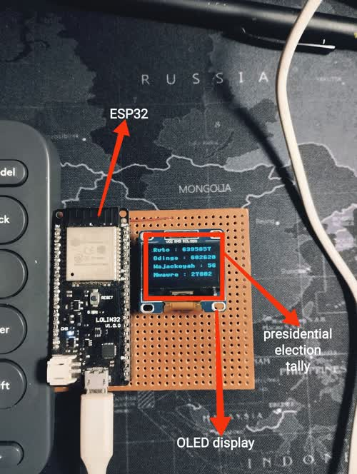

<h1 align="center"> Presidential Elections Monitor </h1>
<p align="center">
    
</p>

## <b>Description</b>
This is a Hardware engineer's way of monitoring the presidential poll. The system is made up of three subsystems
1. [Scraper](scraper/)
2. [API](api/)
3. [Hardware and Firmware](hardware/README.md)

### 1. Scraper
Scrape presidential tally election data off either:
1. [Citizen Tv's election portal](https://elections.citizen.digital/)
2. [BBC News](https://www.bbc.com/news/world-africa-62444316)

public portals and stores this to a csv file.

> :warning: This are not the official results. Please visit iebc.or.ke for more information.

### 2. API
Provides a simple API interface to the scraped data. The api is built with [FastAPI](https://fastapi.tiangolo.com/)

### 3. Hardware and firmware
An ESP32 microcontroller running [micropython](https://micropython.org/) more details [here](hardware)
## <b>Prerequisites</b>
1. [Python](https://www.python.org/downloads/)
2. [Docker and Docker Compose](https://docs.docker.com/get-docker/)

## <b>API and Scraper Setup</b>
<details>
<summary>Click to expand!</summary>

### Clone the repository
```bash
$ git clone https://github.com/DanNduati/Elections_watch.git
$ cd Elections_watch/
```
### 1. Local Installation
#### Install dependencies
Create a python virtual environment activate it and install dependencies
```bash
$ python3 -m venv venv
$ source venv/bin/activate
$ pip install -r requirements.txt
```
#### Schedule the scraper
> :warning: The cron service is only available for **Unix-based systems** checkout the Windows OS equivalent to a cron job called a [scheduled task](https://active-directory-wp.com/docs/Usage/How_to_add_a_cron_job_on_Windows/Scheduled_tasks_and_cron_jobs_on_Windows/)

Schedule the scraper to run every `n`th duration with cron. In my case i ran the scraper every 15 minutes by adding the following to your crontab file:
```bash
$ crontab -e
```
```bash
*/15 * * * * <path to your virtual environment python executable> <path to the scraper script>
```
As usual I run my cronjobs on my Pi by adding the following to the current user's crontab file:
```bash
*/15 * * * * /home/pi/Desktop/Elections_watch/venv/bin/python /home/pi/Desktop/Elections_watch/scraper/scraper_bbc.py
```

#### Run the API server
Run the API server with exposing port 8000:
```bash
$ uvicorn api.main:app --port 8000 --host 0.0.0.0
```
</details>


### Check the API
#### 1. <b>Presidential Results endpoint</b>
```http
GET /election/
```
__Sample request__
```bash
curl -X 'GET' \
  'http://0.0.0.0:8000/election/' \
  -H 'accept: application/json'
```
__Sample response__
```json

{
  "data": [
    {
      "CandidateName": "William Ruto",
      "Coalition": "Kenya Kwanza Alliance",
      "Votes": 6395857,
      "Percentage": "51.1%",
      "Atleast25PercentOfCounty": "21/47",
      "CandidateImage": "https://news.files.bbci.co.uk/include/vjafeast/642-kenya-presidential-elections-results/assets/app-project-assets/img/candidates/kka.png",
      "UpdatedAt": "08/13/2022, 18:09:04 local time (GMT+3)",
      "Source": "https://www.bbc.com/news/world-africa-62444316"
    },
    {
      "CandidateName": "Raila Odinga",
      "Coalition": "Azimio la Umoja coalition",
      "Votes": 6026207,
      "Percentage": "48.2%",
      "Atleast25PercentOfCounty": "19/47",
      "CandidateImage": "https://news.files.bbci.co.uk/include/vjafeast/642-kenya-presidential-elections-results/assets/app-project-assets/img/candidates/alu.png",
      "UpdatedAt": "08/13/2022, 18:09:04 local time (GMT+3)",
      "Source": "https://www.bbc.com/news/world-africa-62444316"
    },
    {
      "CandidateName": "George Wajackoyah",
      "Coalition": "Roots Party",
      "Votes": 56700,
      "Percentage": "0.5%",
      "Atleast25PercentOfCounty": "0/47",
      "CandidateImage": "https://news.files.bbci.co.uk/include/vjafeast/642-kenya-presidential-elections-results/assets/app-project-assets/img/candidates/roots.png",
      "UpdatedAt": "08/13/2022, 18:09:04 local time (GMT+3)",
      "Source": "https://www.bbc.com/news/world-africa-62444316"
    },
    {
      "CandidateName": "David Mwaure",
      "Coalition": "Agano Party",
      "Votes": 27802,
      "Percentage": "0.2%",
      "Atleast25PercentOfCounty": "0/47",
      "CandidateImage": "https://news.files.bbci.co.uk/include/vjafeast/642-kenya-presidential-elections-results/assets/app-project-assets/img/candidates/agano.png",
      "UpdatedAt": "08/13/2022, 18:09:04 local time (GMT+3)",
      "Source": "https://www.bbc.com/news/world-africa-62444316"
    }
  ]
}
```
Alternatively open your browser at: http://0.0.0.0:8000/
You should see the automatic interactive Swagger API documentation:
<p align="center">
    
</p>

### <b>Hardware setup</b>

<p align="center">
    
</p>

### 1. Load Micropython on the ESP32
Checkout this [guide](https://docs.micropython.org/en/latest/esp32/tutorial/intro.html) on how to get started with MicroPython on the ESP32
### 2. Install Ampy
Ampy is a cli tool to interact with MicroPython board over a serial connection.
```bash
$ pip install adafruit-ampy
```
### 3. Load firmware files and run code
Navigate to the hardware directory
```
$ cd hardware/
```
First create your wifi config module `config.py`and add your wifi credentials:

```python
WIFI_SSID = 'myssid'
WIFI_PASSWD = 'mywifipassword'
```
For convenience you can set `AMPY_PORT` and `AMPY_BAUD` environment variables which will be used if the port parameter is not specified. To set these variables automatically each time you run ampy, copy them into a file named `.ampy`

Connect your esp32 to your pc and load the firmware files
```bash
$ ampy put config.py
$ ampy put ss1306.py
$ ampy put main.py
# Confirm the board has all files
$ ampy ls
/config.py
/main.py
/ssd1306.py
```
Wire up your display to the ESP32:
* `SCL` -> GPIO22
* `SDA` -> GPIO21
* `5v` -> 5v
* `GND` -> GND

Power up the board, reset it and viola!

#### Debugging hardware issues

<details>
<summary>Click to expand!</summary>

If you ran into an issue with the hardware, you can check the device's serial output.

To check the device name for the serial port of your ESP32 board run this command two times, first with the board unplugged, then with plugged in. The port which appears the second time is the one you need:

```bash
$ ls /dev/tty*
```
Open the serial port with whatever serial terminal tool you have I use `picocom` you could also try `screen` or `minicom`:

```bash
$ picocom -b 115200 /dev/ttyUSB0
picocom v2.2

port is        : /dev/ttyUSB0
flowcontrol    : none
baudrate is    : 115200
parity is      : none
databits are   : 8
stopbits are   : 1
escape is      : C-a
local echo is  : no
noinit is      : no
noreset is     : no
nolock is      : no
send_cmd is    : sz -vv
receive_cmd is : rz -vv -E
imap is        : 
omap is        : 
emap is        : crcrlf,delbs,

Type [C-a] [C-h] to see available commands

Terminal ready

MPY: soft reboot
Connected to dan_wifi
Network config: ('192.168.100.12', '255.255.255.0', '192.168.100.1', '192.168.100.1')
```
You should see whatever exception error your board run to not me though lol.
</details>

## <b>License and Copyright</b>
[](LICENSE)

Copyright 2022 Daniel Chege Nduati
